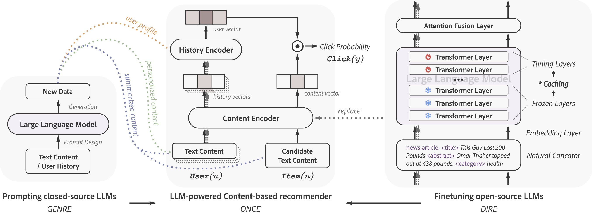

# ONCE: Boosting Content-based Recommendation with Both Open- and Closed-source Large Language Models



## Notes

All the recommendation experiments are conducted under our content based recommendation repository [Legommenders](https://github.com/Jyonn/Legommenders).
It involves a set of news recommenders and click-through rate prediction models.
It is a modular-design framework, supporting the integration with pretrained language models (PLMs) and large language models (LLMs).

**Updated on Oct. 22, 2023**: We have our training code and pipeline established.

**Updated on Oct. 20, 2023**: Our paper has been accepted by WSDM 2023.

## Abstract

> Personalized content-based recommender systems have become indispensable tools for users to navigate through the vast amount of content available on platforms like daily news websites and book recommendation services. However, existing recommenders face significant challenges in understanding the content of items. Large language models (LLMs), which possess deep semantic comprehension and extensive knowledge from pretraining, have proven to be effective in various natural language processing tasks. In this study, we explore the potential of leveraging both open- and closed-source LLMs to enhance content-based recommendation.  With open-source LLMs, we utilize their deep layers as content encoders, enriching the representation of content at the embedding level. For closed-source LLMs, we employ prompting techniques to enrich the training data at the token level. Through comprehensive experiments, we demonstrate the high effectiveness of both types of LLMs and show the synergistic relationship between them. Notably, we observed a significant relative improvement of up to 19.32\% compared to existing state-of-the-art recommendation models. These findings highlight the immense potential of both open- and closed-source of LLMs in enhancing content-based recommendation systems. We will make our code and LLM-generated data available for other researchers to reproduce our results.

## GENRE: Prompting Closed-source LLMs for Content-based Recommendation

### Overview

We call GPT-3.5-turbo API provided by OpenAI as closed-source LLM.
All the request codes are uploaded in this repository.

### Codes and corresponding generated data

|  Dataset  |            Schemes             |           Request Code           |                            Generated Data                            |
|:---------:|:------------------------------:|:--------------------------------:|:--------------------------------------------------------------------:|
|   MIND    |       Content Summarizer       |       `news_summarizer.py`       |                   `data/mind/news_summarizer.log`                    |
|   MIND    |         User Profiler          |     `user_profiler_mind.py`      |                    `data/mind/user_profiler.log`                     |
|   MIND    | Personalized Content Generator | `personalized_news_generator.py` |      `data/mind/generator_v1.log`, `data/mind/generator_v2.log`      |
| Goodreads |       Content Summarizer       |       `book_summarizer.py`       |                 `data/goodreads/book_summarizer.log`                 |
| Goodreads |         User Profiler          |   `user_profiler_goodreads.py`   |                  `data/goodreads/user_profiler.log`                  |
| Goodreads | Personalized Content Generator | `personalized_book_generator.py` | `data/goodreads/generator_v1.log`, `data/goodreads/generator_v2.log` |

## DIRE: Finetuning Open-source LLMs for Content-based Recommendation

We use BERT-12L, LLaMA-7B and LLaMA-13B as open-source LLMs.


## Training Pipeline

### Overview

According to the Legommenders framework, we have the following training pipeline:

- **Data Tokenization**: We preprocess the raw data into the format that can be used by the recommenders.
- **Configurations**: We set the configurations, including data selection, lego module selection, weight initialization, and hyperparameters setting. 
- **Training Preparation (optional)**: Before finetuning the open-source LLMs, we will first cache the upper layer hidden states to accelerate the training process.
- **Training and testing**

, and GENRE and DIRE will be integrated at different stages.

|        Pipeline         | ORIGINAL | GENRE | DIRE |                             Comments                              |
|:-----------------------:|:--------:|:-----:|:----:|:-----------------------------------------------------------------:|
|    Data Tokenization    |    √     |   √   |  ×   |          New data generated by GENRE will be tokenized.           | 
| Config: Data Selection  |    √     |   √   |  ×   |          DIRE can use the same data as the original one.          |
| Config: Lego Selection  |    √     |   ×   |  √   |     GENRE can use the same lego modules as the original one.      |
|  Config: Weight Init.   |    √     |   ×   |  √   | GENRE can use the same weight initialization as the original one. |
| Config: Hyperparameters |    √     |   ×   |  √   |    GENRE can use the same hyperparameters as the original one.    |
|     Training Prep.      |    ×     |   ×   |  √   |      Only DIRE needs to cache the upper layer hidden states.      |
|        Training         |    √     |   √   |  √   |                                                                   |

### Preparation

- Install `UniTok`, `pigmento`, `refconfig`, `oba` and `smartdict` package.
- For LLaMA in DIRE, please download or convert to transformers-supported version.
- If you want to reproduce the data tokenization, please download the raw data from [MIND](https://msnews.github.io/) and [Goodreads](https://sites.google.com/eng.ucsd.edu/ucsdbookgraph/home).
- If you want to use the tokenized data, please download it from here, and you can skip the preprocessing step.

### Data Tokenization (Optional)

Please refer to `process/mind/processor_unitokv3.npy` and `process/goodreads/` for the tokenization results.
More detailed instructions can be found in [UnifiedTokenization](https://github.com/Jyonn/UnifiedTokenization) repository.
To integrate GENRE-generated data, similar operations should be conducted, or you can directly use the tokenized data provided by us.

### Configurations

Please refer to `config/data/mind.yaml` and `config/data/goodreads.yaml` for the data selection.

Please refer to `config/model/lego_naml.yaml` and other config files for the lego module selection.

Please refer to `config/embed/null.yaml` and other config files for the weight initialization.

Please refer to `config/exp/tt-naml.yaml` and other config files for the hyperparameters setting.

Hyperparameters in running `worker.py`:
- `llm_ver`: Large language model version. Related to the path of your downloaded model. For BERT, please set to `12L`, as the selected version is `bert-base-uncased` in `/exp/model/bert-<basemodel>.yaml`. For LLaMA, please set to `7b` or `13b`. It would related to the downloaded path of your models, and caching path of items in `config/model/llama-<basemodel>.yaml`.
- `lora`: Low-rank Adapation. Should be set to `0` during caching.
- `layer`: Frozen layers. Should be set to `0` during caching. Should be set to a cached number of layers during training.
- `embed_hidden_size`: Should be set to the dimension size of LLMs. If not correctly set, there would be a projection layer from the original dimension to the set dimension. Please do not make it happen during content caching.
  - BERT-12L: 768
  - LLaMA-7B: 4092
  - LLaMA-13B: 5120.
- `hidden_size`: dimension size that fed into the user encoder. We will not use this feature during caching.
- `fast_eval`: During evaluating or testing the performance of the recommenders, the parameters are not gradient. Thus, for each item and user, we can only calculate their representation once. That would boost the model evaluating and testing. We will not use this feature during caching.
- `lr`: learning rate.
- `item_lr`: learning rate for item encoder if is pretrained language model.

### Training Preparation (for tuning LLaMA)

```bash
python worker.py --embed config/embed/<embed>.yaml --model config/model/llama-naml.yaml --exp config/exp/llama-split.yaml --data config/data/mind-llama.yaml --version small --llm_ver <llm_ver> --hidden_size 64 --layer 0 --lora 0 --fast_eval 0 --embed_hidden_size <embed_hidden_size>
```

- Please specific the caching layers and storing dir in `config/exp/llama-split.yaml`.
- If using LLaMA-7B, please specify `embed` as `config/embed/llama-token.yaml`, `llm_ver` as `7b`, `embed_hidden_size` as`4096`. If using LLaMA-13B, please specfy `embed` as `config/embed/llama-token.13b.yaml`, `llm_ver` as `13b`, `embed_hidden_size` as `5120`.
- Please ignore `hidden_size` and `fast_eval`.
- You can use any `config/model/llama-<basemodel>.yaml` file. The downstream recommender is not used during caching.

### Training and Testing

```bash
python worker.py --data config/data/mind-llama.yaml --embed config/embed/<embed>.yaml --model config/model/bert-<basemodel>.yaml --exp config/exp/tt-llm.yaml --embed_hidden_size <embed_hidden_size> --llm_ver <llm_ver> --layer <layer> --version small --lr 0.0001 --item_lr 0.00001 --batch_size 32 --acc_batch 2 --epoch_batch -4
```

- Please specify `embed`, `llm_ver`, and `embed_hidden_size` as the instruction above.
- We set a smaller `batch_size` and accumulate two batches (i.e., `acc_batch`) for network back propagation. We train one fourth of the training data each time (i.e., `epoch_batch`).
